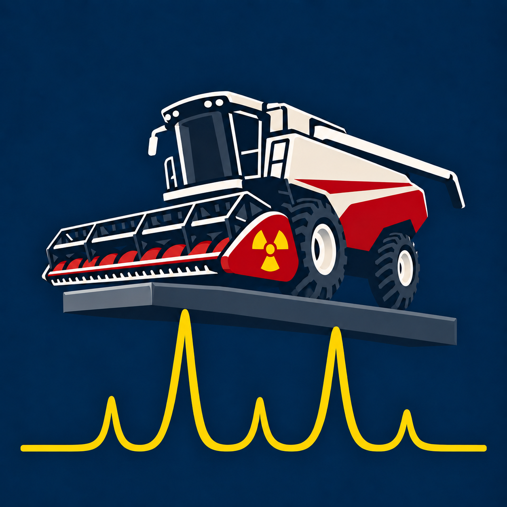

<p align="center">
  
</p>

<h1 align="center">XRD Combine</h1>

Current release: **3.0.1**.

XRD Combine is a desktop application for viewing, comparing, correcting, and
interpreting X-ray diffraction data. It brings measured scans, crystal
structures, calculated diffraction patterns, reflection tables, and pole
figures together in one project-oriented interface.

The application is intended for day-to-day work with individual measurements,
sample series, reference phases, and crystallographic models. Original input
files remain unchanged unless an exported result is explicitly saved.

## Opening files

Drag one or several measurement or CIF files into the main window, including its
plots and dataset tables. A hint appears for a supported batch. Files are added
to **Project data** and compatible objects are assigned to the active page.
Accepted source extensions are `.xrdml`, `.xml`, `.raw`, `.xy`, `.txt`, `.dat`,
`.csv` and `.cif`, including uppercase variants. Directories, remote links and
batches containing unsupported items are rejected. Saved `.xrdproject` and
`.xrdtab` files use the File-menu commands described below.

In Windows Explorer, choose **Open with… > XRD Combine.exe**. Opening source
files again uses the existing window, including when it is minimized. Starting
another copy without files brings the running window forward. Requests arriving
during startup are queued; a modal dialog delays import until it is closed.
Paths with spaces and Unicode, multiple files and parallel launches are supported.
The queued request retains the workspace active when the running window receives
it. Incompatible objects stay in Project data for assignment to another page.
No file association is installed automatically.

## Main workspace

Files are opened in the **Project data** panel and can then be assigned to the
appropriate page with their checkboxes. The workspace is divided into four
main pages. The panel width and all three table-column widths can be adjusted
with the mouse and are preserved between sessions. Multiple measurements read
from one source file are collected under an expandable source-file node.

### Viewer

The Viewer is used to inspect and compare measured scans and calculated phase
patterns. A single loaded measurement is selected automatically; adding
another measurement preserves the current selection.

- display several measurements and phases on the same plot;
- select the coordinate and intensity axes contained in a measurement;
- overlay compatible phases on a measured angular scan or display them
  separately;
- show a calculated phase as reflection sticks or as a broadened profile;
- use linear, logarithmic, square-root, or squared intensity scaling;
- change curve visibility, color, order, and vertical arrangement;
- apply manual coordinate and intensity corrections;
- align data using selected peaks or stored reference reflections;
- search a selected interval for up to six distinguishable Voigt peaks,
  preview the profiles, and confirm individual components;
- use **Draw peak** to specify a peak's center, height, and full width at half
  maximum (FWHM), then accept it without automatic fitting;
- use **Do Fit** to refine accepted and manually drawn peaks against the
  measurement;
- calculate a background for each measurement and coordinate axis, set
  anchor spacing in source-axis units, and exclude anchors by selecting an
  interval;
- inspect peak positions, heights, FWHM, and integrated profile areas in a
  separate peak table for each measurement;
- assign hkl indices using loaded CIF or Cell Phase structures, and control
  the shaded profile of each peak with its **Fill** checkbox;
- match existing peaks with expected Kα2 or Kβ positions and review the
  proposed spectral classifications;
- display **Show background + fitted peaks** to compare the summed model
  with the experiment;
- calibrate the angular axis from two or three orders of one substrate
  reflection family, with or without a known true peak position;
- switch compatible 2theta data and calculated phase positions to d-spacing
  using one selected wavelength;
- add a corrected result to the project or replace the current working object;
- send selected data to the Comparison window;
- configure axis labels, major and minor ticks, legend, line width, and grid;
- read the cursor coordinates beside the visible-object counters;
- save the current plot as a PNG image.

**Phases > Phase scan** adds oriented CIF and Cell Phase positions for φ, χ,
and ω/θ rocking scans, coupled 2θ–ω scans, and detector-only 2θ scans at fixed
ω. **Auto** follows a φ, χ, or ω measurement; 2θ retains the powder calculation
unless an oriented mode is selected explicitly.

Select **Geometry from** to fill **From … To** ranges for the fixed angles
available in the measurement. Each imported position initially receives a
±0.1° window. Missing bounds remain blank and must be entered before
reflections are drawn. Each window can be narrowed or widened independently;
equal bounds represent an exact fixed angle.
Manual values are retained when switching between measurements; **Use
measurement angles** restores the imported positions with the initial ±0.1°
windows. The scanned coordinate keeps the measurement's scan limits. Ranges
must run from lower to higher values; a φ window crossing zero can be written
as 359.9° … 360.1°.

| Phase scan | Fixed geometry |
| --- | --- |
| φ | 2θ, ω, χ |
| χ | 2θ, ω, φ |
| ω / θ | 2θ, χ, φ |
| 2θ–ω | χ, φ, ω − θ offset |
| 2θ, fixed ω | ω, χ, φ |

Set each phase's surface-normal hkl, an in-plane reference hkl defining sample
X, and φ zero offset. The linked slider and numeric field adjust the offset
for the selected phase. In φ mode this immediately shifts cached reflections
without a new calculation. The reference reciprocal vector is projected onto the
surface plane, as in RSM. The initial orientation is (001) with (100) defining
X; adjust it to the sample. The four-circle convention matches RSM at χ = φ =
0 and uses `q_sample = Rz(-φ) Rx(-χ) q_RSM`; the φ zero offset is subtracted
from the instrument φ. Check the instrument's angle conventions when comparing
positions.

These oriented modes predict reflection **positions**. Sticks have equal height;
profile FWHM is illustrative and does not predict measured intensity, mosaic
spread, or instrumental broadening. An oriented reflection is included when
an exact diffraction geometry exists within all the fixed-angle windows.
One representative position near their nominal midpoints is shown, with
periodic copies where the scan crosses a full turn. **Maximum |h|, |k|, |l|**
sets the finite reflection search range (10 by default). Calculations run in
the background and outdated results are discarded after geometry changes.
Oriented settings belong to the project for the current session. Fixed-angle
ranges are retained separately for each measurement and source axis; phase
orientations and φ offsets are retained per phase. Recreating Viewer restores
these accepted values. Unfinished or invalid text remains a local input draft.

Moving the cursor over a scan or the separate phase panel shows the coordinate
and Y value beside **Visible measurements / phases**. The readout follows that
panel's axes and units, including d-spacing and nonlinear intensity ticks,
and clears when the cursor leaves the plot. Point selection is independent.

CIF rendering is disabled while any visible measurement uses X, Y, Z, or
another unsupported coordinate. The phase remains loaded. Overlay requires
matching angular coordinates; different supported coordinates use separate
plots. Oriented scan coordinates remain in degrees; d-spacing display is
available for the powder 2θ mode.

Peak search limits candidate centers to the selected interval while fitting
their tails against neighbouring measured points. Confirming a detected group
jointly refines nearby overlapping components and can adjust the background
locally; distant accepted groups retain their parameters. **Do Fit** refines
the accepted groups without detecting new peaks. Background estimation aims
to retain broad scattering bands while separating narrower peaks, and local
fit corrections fade into the existing background outside each group.

Accepted peaks, backgrounds, spectral classifications, and hkl assignments
belong to the project model for the current session. Hiding a graph with the
Viewer visibility checkbox or reopening its peak table preserves them.
Removing a measurement from Viewer clears its analysis on every axis, even
though the measurement itself remains in the project. This applies both to
the project's Viewer checkbox and to Viewer's Remove/Clear actions; assigning
the measurement again starts with no accepted peaks or background. Replacing
or deleting measurement data also clears its analysis. Deleting a phase or
editing its cell clears only hkl assignments linked to that phase. Project and Viewer-tab files preserve these accepted results. Symmetric Voigt profiles
and the chosen background can leave visible residuals for asymmetric or missing
features.

Viewer presentation settings also belong to the project: dataset order, active
source axes, visibility, colours, correction previews, selected dataset,
intensity and horizontal scales, current plot limits, phase layout, profile
width and phase heights. Recreating the tab restores these settings in either
plot renderer, including independent measurement and phase views. Removing an
object from Viewer discards its Viewer settings; hiding its graph preserves
them. Replacing a measurement refreshes its working data and measured-angle
defaults while preserving its colour and visibility. Save a project or Viewer-tab file to restore these settings after restarting.

**Find Kα2** supports Cu and Co radiation presets; **Find Kβ** is available
for Cu. These actions classify existing table entries without adding peaks
or running a new fit. Custom radiation is not classified automatically.

**Experimental cell indexing** is hidden by default. Enable **Toggle
indexation** under **About > Debug**, then open **Detected peaks… > Index
cell…**. Choose Visser or Boultif–Louër, review the primary peaks and search
constraints, run the calculation in the background, and inspect candidate
cells and residuals. A selected candidate opens the existing Cell Phase editor;
accepted hkl assignments return to the peak table. The choice is remembered,
and disabling it closes indexing windows and hides the command.

These implementations use bounded searches and do not guarantee finding the
correct or unique lattice. Apply corrections to the measurement and refit
peaks before indexing; visual plot transforms are excluded. See
[INDEXING.md](INDEXING.md) for the workflow, validation and scientific limits.

### Structures

The Structures page combines crystal-structure inspection with diffraction
calculations.

**Structure view**

- display atoms, bonds, the unit-cell box, basis vectors, and polyhedra;
- control visibility, color, and opacity by element or crystallographic site;
- display mixed and partially occupied positions;
- include neighbouring atoms and bonds outside the selected unit cell;
- use color or black-and-white presentation modes;
- apply engraving and face hatching to polyhedra;
- orient the structure along direct or reciprocal lattice directions, or an
  `hkl` plane normal;
- rotate, pan, and zoom the model interactively.

Structure scenes are prepared in the background as soon as a CIF is added to
the project, including files opened in Viewer. A small nonmodal **Loading
structure...** window stays visible during preparation. The Structures page
and calculated pole preview share the cached scene and any pending job.
Switching pages reuses the prepared geometry; the first display still
initializes the OpenGL buffers. The notice is localized in all three interface
languages.

**Calculated pattern**

- calculate a powder diffraction pattern from a CIF structure;
- display individual reflection sticks or a broadened profile;
- set the angular range, minimum intensity, peak width, and radiation lines;
- save the calculated plot as a PNG image.

**Reflection table**

- inspect `hkl`, d-spacing, θ and 2θ, wavelength, line weight, multiplicity,
  structure factor, and calculated intensity;
- sort the table by any displayed quantity;
- export the table to CSV.

A **Cell Phase** can also be created manually from a space group and unit-cell
parameters when an atom-free phase is sufficient for the intended operation.

Structures settings belong to the project for the current session. Recreating
the page restores orientation, atom and polyhedron visibility, site colours,
opacity, engraving and hatching, atom size, and camera pan/zoom. The calculated
pattern and reflection table retain accepted calculation parameters, pattern
style, plot bounds, table sorting, column widths and the selected reflection.
The active subtab is retained as well. Changing or unassigning the structure
clears its geometry, site overrides, selected reflection and calculated caches;
general display and calculation options remain available for the next structure.

### Pole figures

The Pole figures page supports both measured and calculated pole data.

- open experimental pole-figure data from supported RAW and text formats;
- define angular coordinates manually when they are not stored in the source;
- inspect individual points and their values;
- choose the color map, scale, interpolation, and grid presentation;
- calculate crystallographic poles from a CIF structure or Cell Phase;
- combine first- and second-phase pole sets;
- configure orientations, pole labels, and marker sizes;
- locate an entered hkl with a temporary outline, including outside the
  displayed reflection range;
- set the displayed reflection range in d-spacing or 2θ;
- inspect θ and 2θ in calculated reflection details and centring choices;
- view the corresponding crystal structure beside a calculated pole figure;
- rotate the pole figure and structure synchronously in either direction.

In **Calculated > Locate hkl**, choose the phase, enter h, k and l, and press
**OK** or Enter. An orange outline marks that pole in the phase's current
orientation for two seconds. A new request restarts the timer. The locator
also works outside the displayed range, without changing the range, rotation,
centring or selected pole. It marks a reciprocal-lattice direction; an outline
does not imply a nonzero diffraction intensity.

In **Displayed reflections**, select **d, Å** or **2θ, °**. Switching modes
converts the existing interval with Bragg's law. The pole figure uses the
shortest wavelength among the selected radiation lines, consistent with its
reflection details. In 2θ mode, changing radiation preserves the entered angular
limits and recalculates which reflections fall inside them. A lower angular
bound of zero corresponds to an unbounded upper d limit.

Pole-figure settings belong to the project for the current session. Recreating
this page restores phase order, centring and rotations, joint rotation, labels,
marker styling, projection and accepted reflection ranges. Removing the primary
phase promotes the overlay with its orientation and styling intact. Unassigning
a phase discards that layer's temporary geometry; assigning it again starts with
the default orientation. Replacing a phase's cell resets its orientation and
reflection cache without changing the other layer.

Experimental pole figures retain accepted manual tilt-angle series, intensity
limits, scale, fill colour and plot navigation. Changing the assigned source
or removing it from the page clears its manual geometry, limits and zoom.
Invalid or unfinished numeric input stays in the controls and does not replace
accepted model values. The active Experimental/Calculated tab is also retained.
Project and Pole-figures-tab files preserve these accepted settings. The compact structure preview retains its own atom visibility,
colours, display settings and camera in the project model, independently of
the Structures page. Its orientation follows the calculated pole figure.

### Reciprocal-space maps (RSM)

The RSM page has separate **Experimental** and **Calculated** tabs.

- Open an RSM RAW file, numbered RAW files, or a series of two-column XY files;
- select the data and a CIF through Project data, or open them from the RSM page;
- show an experimental intensity map in angular coordinates or Qx/Qz,
  in linear or logarithmic scale with selectable color maps;
- keep unfinished RAW ranges as gaps instead of filling unmeasured points;
- switch the plot between **Real** (measured area) and **Full** (all declared
  RAW ranges), without changing the saved data or interpolating gaps;
- for an XY series, treat X as 2Theta and enter two of the first, step, and
  last Omega values; the third value is filled in automatically, and the
  application does not change the underlying scan axes;
- read the first, step, and last Omega positions automatically from RAW data;
- choose a loaded CIF or open another one and add its indexed reflection
  markers to measured cells in the experimental map. Enter the surface normal
  and in-plane reference for that overlay; change the wavelength in the
  common radiation selector;
- calculate reciprocal-lattice points from the already loaded CIF and its
  symmetry, with a surface normal, an in-plane direction, and a target given
  as hkl, angular coordinates, or Qx/Qz;
- configure the scattering-plane tolerance, limits, point labels, and target
  marker, then save a PNG of the map.

Mouse wheel and mouse-drag zoom are disabled on both RSM maps. Right-button
drag still pans; display bounds come from Real/Full or the calculated map's
range fields.

RSM uses the same radiation setting as the other pages. The calculated map
shows allowed reciprocal-lattice points; it does not synthesize measured
intensities or model an instrument resolution function.

RSM settings also belong to the project for the current session. Recreating
the page restores accepted XY angles, coordinate and intensity modes, colour
map, Real/Full extent, reflection-overlay phase and orientation, calculated
target and ranges, labels, target marker, plot navigation and the active subtab.
Unfinished or invalid calculation inputs stay local to the controls and do not
replace accepted values. Adding an XY file keeps the two entered angles and
recalculates the derived value for the longer series. Replacing or removing
map sources clears their manual geometry and navigation; changing the
calculated phase clears its previous calculation and orientation.

### Comparison

The Comparison window is designed for presenting related scans as a set.

- assemble measured curves and reference or substrate scans;
- switch between overlaid and vertically offset presentation;
- control curve colors, order, and intensity scaling;
- browse the result as a thumbnail gallery and open a detailed plot;
- copy or save the resulting figures.

Comparison keeps its existing file-based display-bound presets. Its composition
and window state are outside project and tab save/load.

## Saving projects and tabs

Use **File > Save project** (`Ctrl+S`) or **Save project as…** (`Ctrl+Shift+S`)
for a complete `.xrdproject` file. **Open project…** (`Ctrl+O`) replaces the
current project with the saved documents, workspace assignments and accepted
settings. **Save current tab…** creates an `.xrdtab` for Viewer, Structures,
Pole figures or RSM. **Load tab…** restores the section named in that file;
it does not depend on which section is currently open. Its previous assignments
are replaced, while the other sections and their analysis remain in the project.
Existing project objects are reused when their source and correction recipe match;
a different saved version is imported separately.

Files contain source paths and checksums, workspace settings, accepted peaks,
background anchors, spectral relationships and hkl assignments. Original scan
and CIF contents are **not embedded**. Manually defined Cell Phases are stored
as cell parameters and a space-group setting. Applied corrections are recorded
as ordered operations, including the axis used at each step, and replayed from
the original scan when loading. A new corrected curve remains linked to its
parent measurement. PyQtGraph plot formatting also restores line width, custom axis labels, grids,
legend and tick visibility in Viewer and calculated patterns. Numeric source
arrays, calculated caches, widgets, unfinished input, active dialogs, pending
calculations and direct Matplotlib toolbar edits are not serialized. The previous
in-memory undo/replacement snapshots are not restored.

Keep the session file and its input files together when moving work to another
computer. Relative paths are tried first; the original absolute path is also
stored. If a file cannot be found, use **Locate file…**, skip that source or
cancel loading. If its contents changed, choose the original file or explicitly
use the changed data. Using changed data retains applicable settings and replays
saved corrections, but clears dependent accepted analysis, hkl assignments,
source-specific orientation and navigation. Skipping an unavailable source also
omits its derived curves and unavailable relationships. Cancelling or failing
source/format validation leaves the current project open.

A complete project also restores radiation, active workspace, language, theme,
plot renderer, atom palette/custom colours, window size and project-panel layout.
Loading a tab keeps the current application appearance. Radiation is shared by
all sections, so a tab file restores its saved radiation profile for the whole
project. Comparison remains outside these files and uses its existing bound
presets. Save/load does not reopen its window or alter its composition.

The files use versioned JSON and can be inspected in a text editor. Writes
replace a previous save only after successful serialization. The reader rejects
unsupported schema versions, invalid settings, duplicate identities and malformed
relationships. The maximum session-file size is 64 MiB. There is no automatic
project reopening or autosave; use the File commands explicitly.

## Supported files

| Format | Typical use |
| --- | --- |
| XRDML / XML | Measured scans with instrument axes and metadata |
| Bruker RAW v3 / v4 | Measured scans, supported pole figures, and reciprocal-space maps |
| XY / TXT / DAT / CSV | Two-column diffraction data and supported pole data |
| CIF | Crystal structures, calculated patterns, reflections, and poles |
| XRDPROJECT / XRDTAB | Saved project or individual workspace; original input files remain separate |

The exact information available after import depends on the contents of the
source file. For example, an XRDML file may provide several coordinate or
intensity axes, while a simple two-column file normally contains only one of
each.

Bruker RAW v3 and v4 files are read by one shared parser for Viewer, reciprocal
space maps, and experimental pole figures. Each range retains a `ScanPath`
describing every known moving drive, including coupled motion, while the file
retains a `MeasurementGeometry` describing its inner and outer scan axes. For
RAW1.01 (v3), confirmed primary-axis codes cover locked coupled and detector
scans, Theta, Chi, Phi, X-Drive, and Z-Drive. The imported scan uses the recorded
starting coordinate and step. Fixed motor positions remain in the metadata
rather than appearing as selectable per-point axes; confirmed coordinates
that vary during a range remain selectable. Original channels, file and range
metadata, acquisition timing, generator settings, and measurement status are
retained. Technical codes 9999 and 129 remain indexed by point until their
physical coordinates are established; unknown codes are retained without
guessing an axis.

To export decoded RAW metadata and complete source headers without intensity
arrays, run:

```bash
python -m xrd_workbench.bruker_raw measurement.raw --json report.json
```

## Installation

Python 3.10 or newer is recommended. Using a dedicated virtual environment is
strongly advised.

```bash
python -m pip install -r requirements.txt
```

Start the application with:

```bash
python run_xrd_combine.py
```

The package entry point is also available:

```bash
python -m xrd_workbench
```

Files may be supplied on the command line:

```bash
python run_xrd_combine.py measurement.xrdml structure.cif
```

To print the installed application version without opening a window:

```bash
python run_xrd_combine.py --version
```

## Quick start

1. Open one or more measurement, text, RAW, or CIF files from the Project data
   panel.
2. Select **Viewer**, **Structures**, **Pole figures**, or **RSM**.
3. Enable the required objects with their checkboxes.
4. Expand the controls on the left to choose axes, display modes, limits, and
   calculation parameters.
5. Save plots, reflection tables, or corrected data explicitly when needed.

## Mouse controls

For two-dimensional plots:

- left button: select a point or pole where selection is available;
- left-button drag: select an interval or draw a peak when the corresponding
  peak or background tool is active;
- right-button drag: pan the plot;
- rectangle-zoom tool: enlarge a selected region;
- Home button: restore the full view.

For the three-dimensional structure view:

- left-button drag: rotate the structure;
- right-button drag: pan the structure;
- mouse wheel: zoom.

## Interface settings

XRD Combine includes Russian, English, and French interface languages, along
with system, light, and dark application themes. Radiation settings and stored
reference peaks can be configured from the application menus.

Compiled Windows builds also provide experimental per-user file associations
under **About > Debug**. XRDML, RAW, XY, and CIF associations can be registered
or removed without administrator rights. The application does not claim the
generic XML, TXT, DAT, or CSV extensions.

The same Debug dialog contains **Toggle indexation** for the experimental
indexing interface. It is off until explicitly enabled and changes are applied
with **OK**.

Closing the main application window, including through the File menu, asks
for confirmation. **Cancel** leaves the application open.

## Packaging the application icon

For PyInstaller, use the ICO as the executable icon and include both runtime
images:

```text
--icon "xrd_workbench\resources\xrd_combine.ico" --add-data "xrd_workbench\resources\xrd_combine.ico:." --add-data "xrd_workbench\resources\xrd_combine.png:."
```

**Windows build with the startup image**

Build from the project directory using the supplied `XRD_Combine.spec`:

```powershell
py -m pip install -r requirements.txt
py -m pip install pyinstaller
py -m PyInstaller --clean --noconfirm XRD_Combine.spec
```

The build uses **onedir** with no console window and keeps dependencies beside
`dist\XRD Combine\XRD Combine.exe`. Distribute the complete
`dist\XRD Combine` folder. The spec includes the application images, reference
database, runtime resources, required packages, and license notices.

The static image at `xrd_workbench/resources/startup_splash.png` is displayed
before Qt loads, limited to approximately 650 × 433 pixels, and closed after
the main window appears. It has no changing text or progress indicator.
Direct Python launches work without the startup image. Building the splash
requires a Python installation with Tcl/Tk support; packaged Windows startup
still requires a native Windows check.

For Nuitka, use:

```text
--windows-icon-from-ico=xrd_workbench/resources/xrd_combine.ico --include-data-file=xrd_workbench/resources/xrd_combine.ico=xrd_combine.ico --include-data-file=xrd_workbench/resources/xrd_combine.png=xrd_combine.png
```

## Tests

Run the automated test suite from the project directory:

```bash
python -m pip install pytest
python -m pytest -q
```

See `VALIDATION.md` for the validation record supplied with this release.

## Documentation

- [CHANGELOG.md](CHANGELOG.md) — consolidated changes in 3.0.1 since 3.0.1b;
- [GITHUB_RELEASE_NOTES_3.0.1.md](GITHUB_RELEASE_NOTES_3.0.1.md) — release notes for 3.0.1;
- `VALIDATION.md` — automated and manual validation record;
- `ARCHITECTURE.md` — internal module boundaries and design notes;
- `THIRD_PARTY_NOTICES.txt` — notices for bundled third-party components.

## License

XRD Combine is distributed under the MIT License. See `LICENSE` for the full
license text.

Copyright (c) 2026 Mikhail Mirushchenko.

## How to cite

If you use `XRD Combine` in academic work, please cite the Zenodo record:

[](https://doi.org/10.5281/zenodo.22809711)

You can also use the metadata provided in [`CITATION.cff`](CITATION.cff).
